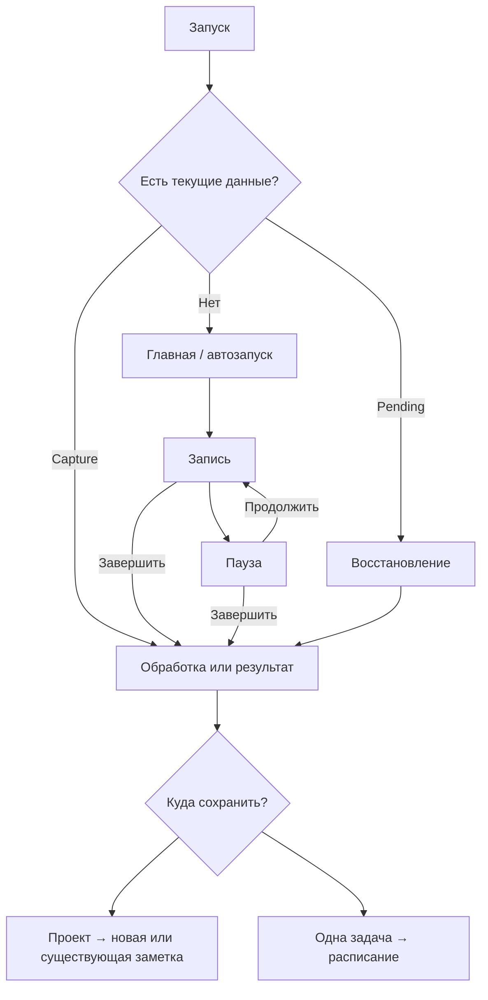

# 04. Запись, Главная, результат и глобальный плеер

## 1. Назначение и область требований

Документ задаёт полный сценарий захвата: запуск приложения → запись → завершение аудио → расшифровка → редактирование → необязательная обработка текста → сохранение одной заметки или одной задачи. Он также описывает прослушивание аудио и сохранность текущего действия при переходах между экранами.

Нормативный визуальный источник — [принятые решения](./00-decisions.md). Из референса сохраняются тёплая материальность, светящийся центральный объект и мягкая композиция. Шрифт, настоящий знак, отдельные команды сохранения и реальные состояния определяются текстовым каноном. Фотография гречки разрешена только на сплеш-экране; рабочая Главная использует процедурный фон.

Размеры ниже даны в логических `dp`, размеры текста — в `sp`; это базовые значения для масштаба текста 100%. Системные safe area не входят в указанные размеры. Общие токены и доступные цветовые варианты задают [основы](./02-foundations.md), компоненты — [каталог](./03-components.md), графику и анимацию — [графика и движение](./08-graphics-motion.md). Поведение при 200% текста и больших окнах уточняется в [адаптивности](./07-adaptive-accessibility.md).

## 2. Проверенный код и разница с целевым интерфейсом

Статический срез: `main` на `ca3793e4e603dcf340cdaca565f089bd57c5d77a`; незавершённая iOS-работа — PR #9, `platform/ios-production` на `d22d1dfb3cd9baa801afa4249e48988107998a36`. Наличие кода не означает проверку поведения на физическом устройстве. Эта глава фиксирует исходную точку; последующие главы являются требованиями к реализации редизайна.

| Область | Подтверждено по коду | Что требуется довести |
|---|---|---|
| Главная | `HomeScreen` различает запись, обработку, текущий capture и idle | Состояния permission, восстановления, `NEEDS_MODEL`, финализации и локальных ошибок сделать явными |
| Автозапуск | `Preferences.autoRecord=true`; `launch()` защищён от повторного запуска, проверяет текущий capture и pending | Первый доступ к микрофону объяснять до системного запроса; не запускать повторно после фонового возврата |
| iOS в main | Тестовый `IosEntry` принудительно выключает autoRecord | Не считать эту заглушку продуктовым правилом |
| iOS в PR | Добавлены AVAudioRecorder/AVAudioPlayer, локальное распознавание готового файла, pending `.m4a`, постоянное хранилище | Приёмка разрешений, прерываний, восстановления, уровня сигнала и жизненного цикла остаётся отдельной работой |
| Запись при навигации | `navigate()` не останавливает recorder; глобальный плеер находится вне содержимого вкладок | Сохранить этот контракт в новой оболочке; не создавать recorder в `HomeScreen` |
| Пауза | Есть `pauseRecording()` и `resumeRecording()`; время паузы не добавляется к `elapsed` | `poll()` сейчас добавляет нули в `liveWave` на паузе. Требуется заморозить последнюю форму |
| Отмена записи | `discard()` удаляет существующий capture | В `RecorderGateway` нет отмены активной сессии и безопасного удаления pending; требуется отдельный контракт, см. §18 |
| Транспорт | `GlobalPlayer` поддерживает запись и playback | На Главной он получает развёрнутое представление; компактный дубль рядом не рисуется |
| Взаимное исключение | Начало записи блокируется при playback; `requestListen()` во время записи открывает подтверждение | Добавить симметричный понятный переход из playback в запись, включая playback paused |
| Обработка | `CaptureStatus` и `working` уже существуют | `POLISHING` не всегда означает tidy; подпись должна учитывать реальное действие, а не только enum |
| Результат | Один текст; `editRevision`, mutex и autosave с задержкой 400 мс; `flush()` перед отправкой | Состояния сохранения, ошибок и клавиатуры не должны заменять/терять содержимое редактора |
| Сохранение | `sendToNotes()`, `sendToTasks()`, `distribute()`, `saveTaskSchedule()`; одна запись связывается с одной сущностью | Прозрачное подтверждение append, блокировка повторов и понятное завершение потока |
| Подбор проекта | `rank()` вызывается при «В заметки»; `autoRoute` открывает picker после перехода в READY | Не называть это автоматическим сохранением; дать прямой возврат к Result и команде «В задачи» |
| Waveform | Live-уровни приходят из recorder; финальная форма хранится в capture | iOS PR собирает максимум 512 meter samples, а repository сохраняет последние 256. Это не форма всей длинной записи; нужна корректная полная временная шкала |
| Перемотка | `AudioGateway.playCapture()` принимает `fromSeconds`; UI-события seek в StudioState нет | Сделать доступный общий контракт перемотки, не обходить StudioState из composable |
| Скорость | Настройка `savedSpeed` существует; runtime удаляет тишину и кодирует аудио с этой скоростью | Не смешивать скорость подготовки файла с playback rate; не ускорять уже ускоренный файл повторно без явного действия |

Основные исходники:

- [HomeAndPlayer.kt](../../composeApp/src/commonMain/kotlin/brain/studio/HomeAndPlayer.kt) — экраны Главной и транспорта.
- [StudioState.kt](../../composeApp/src/commonMain/kotlin/brain/studio/StudioState.kt) — общий UI state, события, блокировки, редактор, переходы.
- [StudioApp.kt](../../composeApp/src/commonMain/kotlin/brain/studio/StudioApp.kt) — оболочка, область действий, периодическое обновление и autosave.
- [Ports.kt](../../kashaCore/src/commonMain/kotlin/brain/domain/Ports.kt) — существующие интерфейсы recorder, playback и хранилища.
- [Studio.kt](../../kashaCore/src/commonMain/kotlin/brain/studio/Studio.kt) и [Models.kt](../../kashaCore/src/commonMain/kotlin/brain/model/Models.kt) — настройки, telemetry, CaptureStatus и модели.
- [CaptureWorkflow.kt](../../kashaCore/src/commonMain/kotlin/brain/domain/CaptureWorkflow.kt), [BrainData.kt](../../kashaCore/src/commonMain/kotlin/brain/domain/BrainData.kt), [Domain.kt](../../kashaCore/src/commonMain/kotlin/brain/domain/Domain.kt) — обработка текста, привязка источника, title, append, сортировка назначения.
- [StudioProcessing.kt](../../runtime/src/main/kotlin/brain/runtime/StudioProcessing.kt) — runtime-конвейер расшифровки и подготовки сохранённого аудио.
- [ProjectScreens.kt](../../composeApp/src/commonMain/kotlin/brain/studio/ProjectScreens.kt) и [TasksScreen.kt](../../composeApp/src/commonMain/kotlin/brain/studio/TasksScreen.kt) — существующие экраны назначения.
- [StudioStateTest.kt](../../composeApp/src/commonTest/kotlin/brain/studio/StudioStateTest.kt) — уже описанные контрактные сценарии; это ссылка на тесты, не отчёт об их запуске.

## 3. Инварианты сценария

| ID | Обязательное правило |
|---|---|
| CAP-01 | В текущем рабочем сценарии одновременно существует не более одной незавершённой записи/capture. Новая запись не перекрывает pending, обработку или несохранённый результат |
| CAP-02 | Запись и прослушивание взаимно исключаются. Пауза одного процесса не разрешает запуск второго без явного завершения/остановки первого |
| CAP-03 | Вкладка — представление данных, а не владелец аудиосессии. Переключение вкладки не останавливает запись, playback или обработку |
| CAP-04 | На экране существует ровно один интерактивный набор управления текущим транспортом. Большой и компактный варианты читают одно состояние |
| CAP-05 | «Завершить» сохраняет захваченное аудио и запускает предусмотренную обработку. «Отменить запись» удаляет захват после подтверждения. Эти команды не взаимозаменяемы |
| CAP-06 | Готовая запись сохраняется в одну заметку либо одну задачу. Две команды не создают две сущности и не разбивают речь на список задач |
| CAP-07 | Заголовок — первая непустая строка документа. Отдельного поля названия, отдельной AI-команды названия и второй копии заголовка в редакторе нет |
| CAP-08 | Существующий текст при добавлении в заметку не заменяется. Повторное подтверждение того же capture не добавляет текст или аудио повторно |
| CAP-09 | UI показывает успех только после подтверждённого сохранения. Ошибка не стирает текст, выбор назначения или доступный исходный файл |
| CAP-10 | Живой график следует реальному входу. Пауза замораживает форму; тишина во время активной записи постепенно заполняет её минимальными столбцами |
| CAP-11 | Автозапись запускается один раз при новом запуске приложения при соблюдении условий. Возврат на Главную, закрытие permission-окна, sheet или клавиатуры сами по себе новую запись не создают |
| CAP-12 | Любое внешнее действие AI подчиняется выбору роли и согласию. Автозапуск, retry и autoRoute не обходят consent |

Термин «несохранённый результат» означает «ещё не помещён в заметки/задачи». При этом его текст и аудио должны технически сохраняться для восстановления. Это не основание добавлять раздел «Черновики».

## 4. Система состояний

Состояние экрана строится из трёх независимых фактов: транспорт захвата, стадия capture и playback. Ошибка/подтверждение — временный слой над ними. Одна переменная `busy` не должна заменять эту модель: например, чтение проектов не превращает приостановленную запись в экран обработки.

### 4.1. Приоритет разрешения основного состояния

1. Инициализация, если snapshot и настройки ещё не прочитаны.
2. Активный recorder либо операция управления recorder.
3. Восстанавливаемый pending, если активной сессии нет.
4. Работа над текущим capture.
5. Текущий capture с результатом, отсутствующей моделью или ошибкой.
6. Idle.

Playback отображается в глобальном транспорте и не превращает всю Главную в отдельный экран проигрывателя. Если приоритетные факты противоречат друг другу, новые транспортные действия блокируются, выполняется сверка с адаптерами и показывается сообщение о восстановлении состояния. Нельзя скрывать активный микрофон ради красивого idle.

### 4.2. Состояния и доступность

| Представление | Условие | Основной объект | Основная команда | Что недоступно |
|---|---|---|---|---|
| Launch | `initialized=false` | Сплеш | При длительной ошибке — повтор открытия данных | Запись и навигация по ещё не загруженным данным |
| Permission | Намерение записать, микрофон не разрешён | Объяснение доступа | Разрешить / открыть настройки ОС | Фиктивный таймер, активная waveform |
| Idle | Нет recording, pending, current | Orb | Начать запись | Команды сохранения отсутствующего текста |
| Starting | Запрошен старт, адаптер ещё не подтвердил его | Orb с состоянием ожидания | Нет повторного старта | Pause/Finish до реального начала |
| Recording | `recordPhase="recording"` | Таймер, waveform, тёплый orb | Пауза | Playback; «В заметки»; «В задачи» |
| Recording paused | `recordPhase="paused"` | Замороженная waveform | Продолжить | Playback без завершения записи |
| Finalizing | Выполняется завершение и закрепление файла | Последняя форма и «Сохраняем аудио» | Дождаться; навигация разрешена | Повторное завершение, удаление файла через UI, новый старт |
| Processing | Рабочий `CaptureStatus` после захвата | Спокойный processing visual | Перейти в другой раздел | Редактирование обрабатываемой версии, сохранение незавершённого результата |
| Result | Стабильный текущий capture | Редактируемый текст | В заметки / В задачи | Новая запись поверх текущего результата |
| No text | Обработка закончилась без текста | Объяснение и пустой редактор | Повторить / ввести текст | Сохранение пустого текста |
| Needs capability | `NEEDS_MODEL` или достоверная ошибка permission/роли | Конкретная причина | Исправить настройку / разрешить доступ | Бесконечный спиннер |
| Recoverable | Pending обнаружен и доступен адаптеру | Сообщение восстановления | Восстановить запись | Автозапуск поверх pending |
| Saving | Выполняется привязка capture к note/task | Выбранное назначение | Выполняемая команда с индикатором | Второй параллельный save и смена назначения во время транзакции |

`Finalizing`, `Starting`, `Saving`, `Permission` — целевые состояния представления. Они не объявляются существующими значениями `CaptureStatus` и не требуют искусственного сохранения UI-анимации в Core.

### 4.3. Основные переходы

Схема показывает предметный поток. Она не означает немедленное включение микрофона без permissions или доступность кнопок назначения во время обработки.

| Из | Событие | Проверка/эффект | В | Возврат при отказе |
|---|---|---|---|---|
| Launch | Загружены данные | Сначала восстановление/current, затем autoRecord | Recovery, Processing, Result или Idle/Starting | Экран ошибки загрузки, без записи |
| Idle | Нажат orb | Нет current/pending; playback idle; permission допустим | Starting → Recording | Idle с объяснением ошибки |
| Recording | Пауза | Адаптер подтвердил pause; зафиксировано время | Recording paused | Recording с ошибкой паузы; не рисовать ложную паузу |
| Recording paused | Продолжить | Адаптер подтвердил resume | Recording | Остаётся пауза |
| Recording/paused | Завершить | Единственная операция финализации | Finalizing → Processing/Result | Pending/recovery либо прежнее фактическое состояние адаптера |
| Recording/paused | Отменить запись | При необходимости pause, затем подтверждение | Confirm cancellation | При отказе — явное продолжение/сохранение паузы |
| Confirm cancellation | Подтверждено удаление | Остановлен захват, удалён его pending, обработка не запускалась | Idle | Пауза/recovery с ошибкой удаления |
| Processing | Получен готовый результат | Применена актуальная версия; учитывается autoRoute | Result или выбор проекта | Конкретная ошибка без потери данных |
| Result | Привести в порядок | `flush()` завершён; версия текста зафиксирована | Tidy processing → Result | Прежний текст и сообщение |
| Result | В заметки | `flush()`, ранжирование проектов | Project picker | Result; ошибка не сбрасывает редактор |
| Result | В задачи | `flush()`; проект не требуется | Task editor/schedule | Result |
| Project picker | Назад | Никаких предметных изменений | Result | — |
| Note destination | Подтверждение | `distribute()` с projectId/noteId | Проекты → выбранный проект | То же назначение и доступное повторение |
| Task schedule | Сохранить | Будущий срок, выбран повтор, `distributeTask()` | Задачи → активные | Редактор с сохранёнными значениями |
| Result | Отменить заметку | Подтверждённое удаление текущего capture | Idle | Result с исходным текстом |

## 5. Запуск, сплеш и первый доступ

### 5.1. Сплеш

Сплеш нужен для фактической инициализации. Искусственного минимального времени показа и обязательного рекламного onboarding-каруселя нет. Если данные доступны сразу, приложение переходит к рабочему состоянию сразу.

Композиция: Canvas в текущей теме; solid-знак шириной 168 dp с сохранением исходного aspect ratio, адаптивный диапазон 150–190 dp; центр знака находится примерно на 43% доступной высоты. Охранное поле — не менее 0,25 ширины знака, при ширине 168 dp это 42 dp от другого самостоятельного содержимого. Фотография [buckwheat-dark-macro.png](./assets/buckwheat-dark-macro.png) используется исключительно как материал тёмного сплеша по [правилам ассетов](./assets/README.md): crop под экран, спокойный затемняющий слой, без текста внутри изображения. Логотип остаётся отдельным SVG, не частью bitmap.

Для старта без декодированного изображения показывается тот же Canvas и SVG. Загрузка фотографии не блокирует данные, permissions или начало записи. При ошибке изображения сплеш остаётся корректным. В светлой теме используется бумажный процедурный сплеш без фотографии; переход к оболочке не меняет выбранную тему и не создаёт белой вспышки. Нормативные маски и положение crop задаются в основах.

При инициализации дольше 700 мс появляется одна спокойная строка «Открываем ваши записи» в Body Small и компактный индикатор; 700 мс — порог появления пояснения, не обязательная задержка. При ошибке чтения данных показываются причина и «Повторить». Нельзя стартовать recorder, пока неизвестно, существует ли незавершённый capture.

### 5.2. Первый запуск

1. Прочитать настройки и локальный snapshot. Существующее создание первого проекта при пустом списке сохраняется; это не отдельный экран регистрации.
2. Проверить pending/current. Восстановление имеет приоритет над новой записью.
3. Если записи можно начинать, определить, разрешён ли микрофон.
4. При первом доступе показать короткое объяснение: «Записывайте мысли голосом»; ниже — «Для записи нужен доступ к микрофону. Расшифровку и обработку можно настроить отдельно».
5. Основная кнопка «Разрешить микрофон», вторичная «Пока без записи». Объяснение занимает страницу/один sheet, без серии обучающих экранов.
6. Системный запрос открывается только по явному действию. Системный диалог не перерисовывается средствами Kasha.
7. При разрешении и сохраняющемся намерении записать запускается ровно одна запись. Пользователь сразу видит таймер, состояние «Идёт запись» и транспорт.
8. При отказе пользователь попадает в рабочую Главную без активного таймера. Проекты, задачи, настройки и существующие данные доступны.

`autoRecord=true` остаётся исходным значением Core. Выбор «Пока без записи» не должен молча менять все настройки; он подавляет автозапуск в текущем запуске. На Главной объясняется, как разрешить микрофон. Если permission уже запрещён, новая попытка ведёт в настройки ОС, когда платформа предоставляет такой переход; приложение не вызывает системный запрос бесконечно.

Разрешение распознавания речи и согласие внешнему AI — отдельные состояния. Доступ к микрофону не даёт согласия передать аудио провайдеру. iOS PR запрашивает Speech-доступ при обработке готового файла; целевой UX обязан объяснить именно этот запрос в момент необходимости. Полные правила — в [настройках и приватности](./06-settings-privacy.md).

### 5.3. Правила автозапуска

| Ситуация | Поведение |
|---|---|
| Новый запуск, autoRecord включён, permission есть, current/pending нет | Одна новая запись после инициализации |
| Пользователь вернулся из настроек ОС | Сверить permission; продолжить только ранее явно запрошенный старт в том же потоке, без второго старта |
| Приложение вернулось из фона | Восстановить фактическое состояние; не считать это новым запуском |
| Пользователь открыл Главную с другой вкладки | Показать текущую сессию или idle; автозапуск не повторять |
| Есть несохранённый результат | Открыть результат; не стирать его |
| Есть pending | Восстановить по правилам §15; не начинать вторую запись |
| Пользователь включил autoRecord в настройках | Сохранить Preference для следующего запуска; не включать микрофон внезапно на экране настроек |
| Есть playback, включая paused | Сначала остановить playback по явному подтверждённому действию |

## 6. Главная: общая геометрия

Рабочая Главная не содержит статистику, последние проекты, профиль, новости, рекламный слоган на каждом шаге или декоративные фотографии. Её содержание полностью зависит от текущего действия.

Базовая проверочная область — мобильное окно шириной 390 dp, высота 844 dp, масштаб текста 100%; дополнительные проверки: ширины 320/360/430 dp и малые доступные высоты. Внешние поля — токен горизонтального отступа compact-layout, базово 20 dp. Внутренние размеры всегда рассчитываются после вычитания safe area. Фиксированные координаты из mockup не переносятся в код.

| Зона | Базовое правило |
|---|---|
| Верхняя служебная строка | Минимум 40 dp; небольшая обычная версия официального знака шириной 28 dp с сохранением пропорций; нет текстового дубля «Kasha» |
| Отступ к основному содержимому | 16–24 dp; сокращается до 12 dp в низком окне |
| Содержимое | Занимает остаток между верхней строкой и нижними закреплёнными областями; может прокручиваться |
| Транспорт | Один expanded/compact вариант в зависимости от контекста |
| Зазор перед навигацией | 8–12 dp; не используется как мёртвая зона поверх контента |
| Навигация | Одна поверхность, высота 72 dp, radius 28 dp при обычном масштабе; safe area добавляется снаружи |

Главная при 100% может иметь композиционно большие пустые области. При нехватке высоты сначала уменьшаются пустые промежутки и декоративный orb, затем содержимое становится прокручиваемым. Таймер, Pause/Resume, Finish и путь к навигации не сжимаются до неудобного размера.

### 6.1. Idle

Порядок чтения: небольшой знак → заголовок → короткое объяснение → orb → подпись действия → навигация. Заголовок: «Мысль начинается с голоса», Display 38/42, максимум три строки на ширине 320 dp. Body 16/23: «Запишите, что важно. Текст можно сохранить в заметки или задачи». Пояснение имеет естественную ширину, максимум 300 dp, без искусственного разрыва каждого слова.

Capture-region располагается ниже заголовка и занимает свободный центр. Orb — 184×184 dp, сфокусированный тёплый свет без яркого золотого залития. Внутри находится один Kasha Mic glyph. Подпись «Начать запись», Label 13/18 или Body Small при необходимости читаемости, отступ 16 dp от orb.

Сам orb — единственная команда Record на idle Home. Подпись входит в ту же semantic-группу и не создаёт вторую Tab-stop. Площадь orb полностью нажимаема; invisible hit-area не пересекается с соседними элементами. Касание запускает запись по одному клику, без удержания. Long press не вводит скрытый иной режим.

В idle без загруженного аудио компактный Global Player не занимает пустую панель под orb. Это целевое изменение нынешнего постоянно видимого GlobalPlayer. Если загружен реальный аудиоисточник, внизу появляется compact playback и применяется правило конфликта запуска из §13. Начало записи не заменяется центральным FAB в навигации.

Состояние нажатия: scale 0.98, 80–100 мс, возврат spring 180–240 мс. До фактического старта нет breathing и движущихся столбцов. Пока открывается микрофон, подпись «Начинаем запись» и индикатор действия; повторные нажатия подавлены. После подтверждения адаптера — переход в Recording и один haptic начала.

### 6.2. Idle при невозможности записи

Orb остаётся узнаваемым, но его роль меняется на разрешённое действие: «Разрешить микрофон» или «Проверить микрофон». Нельзя оставлять большую немую disabled-кнопку без пояснения. Если микрофон отсутствует, подпись под объектом: «Подключите микрофон, чтобы начать запись»; повтор проверки доступен после изменения устройства.

Недоступность распознавания не тождественна недоступности микрофона. Если запись возможна, но STT требует настройки, показать «Записать можно. Для расшифровки нужно настроить распознавание» и доступную ссылку на соответствующую роль. Не обещать готовый текст, если адаптер его не обеспечивает.

## 7. Главная: запись и пауза

### 7.1. Композиция Recording

Порядок: бренд-строка → крупный таймер → статус → capture-region → расширенный транспорт → навигация. Текст результата, команды «В заметки»/«В задачи», карточка «Kasha обрабатывает…» и выдуманная живая транскрипция во время записи отсутствуют.

| Элемент | Спецификация |
|---|---|
| Таймер | Hero 46/48; ровная ширина цифр при доступности табличных цифр шрифта; центрирован; не анимировать каждую секунду скачком |
| Формат времени | `00:24` до часа, `1:02:08` после; при длинном времени размер снижается максимум до Display, без обрезки часов |
| Статус | «Идёт запись», Body Small 14/20, 8 dp под таймером |
| Capture-region | Базово 224 dp по высоте, ширина доступного контента |
| Orb во время записи | Диаметр 196 dp; по центру capture-region; спокойная материальная подложка |
| Waveform | Один отдельный foreground-слой поверх центральной части orb; ширина `min(contentWidth, 320 dp)`, envelope до 96 dp |
| Glyph внутри orb | Mic скрывается на время recording/paused, чтобы не совпадать с waveform |
| Зазор к транспорту | 24–32 dp в обычном окне; минимум 12 dp в низком |
| Центральное управление | Pause/Resume, primary 80×56 dp, radius 20 dp; зона с подписью имеет минимум 80 dp по высоте |
| Боковые управления | Cancel слева, Finish справа; icon target 48×48 dp; подпись 12/16 под target с 6 dp зазором |

Waveform — главный функциональный индикатор; orb не имеет отдельной кликабельности в этом состоянии. Пауза выполняется транспортом. Свечение под waveform ограничивается так, чтобы светлая центральная линия не исчезала на светлом центре orb; тон и маска корректируются совместно с доступными токенами. Одна и та же запись не показывается одновременно большой волной и вторым интерактивным мини-плеером под ней.

В низком окне orb полностью скрывается, capture-region сокращается до 96 dp и остаётся реальная waveform. Это ожидаемая адаптация, а не второстепенный урезанный интерфейс. Увеличение шрифта не должно сохранять декоративный круг ценой исчезновения «Завершить».

### 7.2. Поведение времени и сигнала

- Таймер показывает записанное время, исключая паузы. После resume продолжается накопленное время; запуск второй записи всегда начинается с нуля.
- Время выводится из подтверждённой сессии и монотонного времени. Число кадров UI и число полученных meter samples не являются часами.
- Текущие `liveWave` из 80 значений и polling 65 мс — детали нынешней реализации, не обязательная ширина графика. Число видимых столбцов зависит от доступной ширины при сохранении толщины/шага.
- На тишине столбцы имеют минимальную высоту. Не показывать случайный красивый «голос» и не дополнять отсутствующий сигнал заранее нарисованным паттерном.
- Амплитуда нормализуется предсказуемо; один громкий звук не должен на десятки секунд делать всю дальнейшую речь незаметной. Сглаживание не маскирует факт остановки входа.
- При реально подтверждённой потере входа состояние меняется на прерывание/паузу. Отсутствие речи само по себе не равно поломке микрофона.
- Haptic не используется на каждом пике сигнала.

Толщина, шаг, маски, обработка NaN/бесконечностей, RMS, производительность и Reduce Motion нормируются в [графике и движении](./08-graphics-motion.md).

### 7.3. Пауза

По нажатию Pause сначала выполняется операция адаптера. До её подтверждения кнопка блокирует повтор и показывает краткое состояние операции. После успеха glyph меняется на Resume, подпись — «Продолжить», статус — «Запись на паузе».

Таймер останавливается; последний массив waveform фиксируется без постепенного зануления. Orb остаётся того же диаметра, breathing прекращается, glow снижается в спокойное статическое значение. Величина зафиксированной волны не интерпретируется как текущий звук. Accessibility-описание явно содержит «Запись на паузе».

Нажатие «Завершить» на паузе завершает тот же захват. Новая запись, проигрывание и управление системным аудио не запускаются неявно. Возврат из другой вкладки показывает паузу, а не возобновляет микрофон.

### 7.4. Отмена активного захвата

«Отменить запись» открывает подтверждение. Если запись шла, её сначала безопасно ставят на паузу; открытие destructive-sheet не должно уничтожать уже записанные данные. До подтверждения удаления файл сохраняется.

Заголовок: «Удалить эту запись?» Текст: «Аудио этой записи будет удалено. Восстановить его после удаления не получится». Если длительность достоверна, отдельная строка «Записано: 02:18». Два действия:

- «Продолжить запись» — возвращает из подтверждения и явно возобновляет ранее активную сессию. Если сессия была на паузе до открытия sheet, действие называется «Оставить запись» и сохраняет паузу.
- «Удалить запись» — подтверждённое destructive-действие с соответствующим стилем и haptic.

Системный Back/свайп закрывает sheet, оставляя безопасную паузу. Автоматически включать микрофон после dismiss нельзя. Если поставить сессию на паузу не удалось, UI сохраняет отображение фактически продолжающейся записи и не утверждает, что микрофон остановлен.

Требуется новый общий контракт безопасной отмены: остановка устройства, закрытие файла, удаление pending конкретной сессии, отсутствие enqueue/STT/внешней передачи. Нельзя реализовать Cancel как `stopAndUpload()` → `discard()`: между этими вызовами уже может стартовать обработка и передача аудио. До реализации контракта активную кнопку удаления нельзя объявлять работающей; эта возможность является обязательным пунктом завершения редизайна.

## 8. Завершение и обработка

### 8.1. Завершение аудио

Кнопка справа подписана «Завершить». Glyph не должен выглядеть как подтверждение уже сохранённой заметки. Семантическая подпись — «Завершить запись и расшифровать». На паузе действие идентично.

После нажатия запрещены повторный Finish и новая запись. Последняя waveform остаётся на месте; таймер фиксируется на подтверждённой длительности, подпись меняется на «Сохраняем аудио». Recorder освобождается по фактическому завершению адаптера. Только после появления сохранённого capture приложение переходит к обработке.

Название существующего метода `stopAndUpload()` не является продуктовой формулировкой: интерфейс не пишет «Загружаем в облако», если используется локальная цепочка. Если браузер отправляет файл отдельному runtime, честное раскрытие места обработки следует настройкам подключения; слово local-first не отменяет эту границу.

Если финализация закончилась ошибкой, UI выясняет `phase()` и `hasPending()`. Возможные итоги: активная сессия сохранилась; запись завершилась и может быть восстановлена; capture создан, но refresh не удался; файл недоступен. Для каждого показывается соответствующее действие. Повтор кнопки не должен повторно создавать capture из уже принятого источника.

### 8.2. Processing view

Содержимое выравнивается по оптическому центру свободной области. Большая waveform плавно исчезает. На её месте — один процедурный orb диаметром 168 dp с медленным изменением внутреннего светового поля по motion-спецификации, без дыхания и реакции на микрофон. Под ним через 20 dp располагается Title 18/24 с фактической стадией. Дополнительная строка 14/20 появляется только когда объясняет ситуацию. Нынешний `ProcessingRing` размером 84 dp — исходная реализация, которую заменяет этот целевой visual; в компактном транспорте используется небольшой индикатор по каталогу компонентов.

Нельзя рисовать живую расшифровку, если адаптер возвращает только завершённый текст. iOS PR явно использует `shouldReportPartialResults=false`. Готовый фрагмент текста не придумывается для заполнения карточки.

| Фактическая работа | Подпись | Важное различие |
|---|---|---|
| Файл закрывается/переносится в устойчивое хранилище | Сохраняем аудио | Это ещё не успешное сохранение в проект |
| Очередь/подготовка чтения | Готовим текст | Не выводить fake-percent |
| Speech-to-Text | Расшифровываем | Стадия должна соответствовать реальному запросу STT |
| Удаление тишины/подготовка сохранённого файла | Подготавливаем аудио | `COMPACTING` не называется «Приводим в порядок»: речь о звуке |
| Явно запрошенный tidy | Приводим в порядок | Только действие над текстом |
| Первичное завершение workflow / подготовка ранжирования | Готовим текст | `POLISHING` в runtime может обозначать этот этап без tidy |
| Ранжирование по нажатию «В заметки» | Подбираем проект | Желательно сохранять видимым исходный результат, см. §11 |

В существующем API нет надёжной количественной доли завершения: проценты, ETA «осталось 5 секунд» и заполнение progress от 0 до 100 запрещены. Непрерывное движение не имитирует известную скорость вычисления.

Через 10 секунд непрерывной обработки допустима строка «Можно перейти в другой раздел»; она не обещает фоновую работу при закрытии приложения. Если платформа действительно приостанавливает вычисление в фоне, после возврата показывается «Продолжаем обработку». Длительность сама по себе не является ошибкой и не запускает автоматически повторный AI-запрос.

Навигация доступна. Если пользователь ушёл, processing продолжает отражаться в компактной панели. Готовность обновляет панель на «Текст готов» с переходом на Главную, не открывает клавиатуру и не переносит пользователя с задачи/настроек без его действия. Для `autoRoute` сохраняется логика открытия выбора в потоке Главной; если пользователь уже работает в другой вкладке, показ picker откладывается до возврата на Главную. Это улучшение представления текущей Preference, не автоматическое сохранение.

## 9. Результат и прямое редактирование

### 9.1. Композиция

Result посвящён тексту. Большой orb исчезает. Фон становится спокойнее: декоративная геометрия и illumination минимальны, чтобы длинное чтение не конкурировало со световым объектом.

Порядок:

1. Верхняя служебная строка; короткий статус «Текст готов» и меню текущего результата при необходимости.
2. Один редактируемый документ с Body 16/23; минимум 260 dp высоты при достаточном окне, рост по содержимому. Одна Surface либо открытый текстовый холст в рамках компонента; не добавлять вторую карточку вокруг редактора.
3. «Привести в порядок», secondary, полная ширина, высота 56 dp.
4. Две самостоятельные команды «В заметки» и «В задачи».
5. Compact player исходного готового аудио, если он доступен.
6. Навигация.

В обычном компактном окне «В заметки» и «В задачи» располагаются рядом при минимальной ширине каждой кнопки 144 dp, зазор 12 dp; если текст/локализация не помещается, идут вертикально, каждая на полную ширину. «В заметки» — primary, «В задачи» — secondary. Высота обеих 56 dp и одинаковая визуальная важность названий. Это две команды, а не radio choice и не состояние segmented-control. Выбор первой не меняет подпись второй.

«Отменить заметку» — отдельное quiet/destructive-действие в меню текущего результата. Оно не занимает треть кнопочного ряда и не стоит вплотную к «В заметки». Label соответствует текущему словарю; подтверждение раскрывает фактическое удаление текущего текста и его аудио, а не уже сохранённой заметки проекта.

### 9.2. Работа с текстом

- Редактор сразу доступен для касания; отдельной обязательной кнопки «Редактировать текст» между пользователем и результатом нет.
- Клавиатура не открывается автоматически при завершении STT. Пользователь сначала видит результат и выбирает дальнейшее действие.
- Внутри редактора нет отдельных полей «Заголовок»/«Текст». Первая непустая строка сохраняется частью документа и определяет title для списка.
- Ограничение `NoteText.title()` до 90 символов относится к отображаемому/вычисленному названию; оно не обрезает сам документ и не ограничивает первую строку при вводе.
- Вставка многострочного текста, кириллица, эмодзи в пользовательском содержимом, выделение и системные команды copy/paste поддерживаются. Запрет emoji в дизайне не запрещает введённый пользователем текст.
- Пользовательский текст не «исправляется» при вводе скрытой моделью. Tidy запускается только отдельной командой.
- Изменение первой строки обновляет title в производных представлениях после сохранения. Не показывать поверх неё ещё один гигантский заголовок с тем же текстом.
- Snapshot refresh не сбрасывает курсор, выделение, scroll или последние локальные изменения. `editRevision` используется для различения версий, а не для пересоздания всего поля.
- Autosave выполняется после 400 мс отсутствия ввода; перед tidy/route/save — обязательный `flush()` независимо от debounce.
- Статус сохранения делается тихим: «Сохраняем…» только при заметной длительности операции, затем кратко «Сохранено». Это подтверждение сохранённого текста capture, не сообщения «Добавлено в проект».
- При autosave failure редактор остаётся доступным, но рядом возникает «Не удалось сохранить изменения» и «Повторить». Локальный текст сохраняется в UI; отправка не продолжается поверх неуспешного `flush()`.
- Не показывать неподтверждённую возможность восстановления несохранённых последних символов после аварийного завершения. Платформенный checkpoint должен быть частью реализации сохранности.

### 9.3. Клавиатура и низкое окно

При фокусе в редакторе каретка и выделение находятся выше IME с запасом минимум 16 dp. Используется единая прокрутка документа; недопустима вложенная вертикальная прокрутка маленького TextField внутри другой короткой scroll-области.

Нижняя навигация скрывается на время ввода, если иначе не остаётся полезной области текста. При отсутствии активного транспорта скрывается и playback idle. Если звук реально проигрывается или другая сессия записывает в контексте редактора заметки, компактный транспорт остаётся над IME и уменьшает только декоративные части, а не target-ы. На самом Result recorder одновременно не работает по CAP-01.

Действия «Привести в порядок»/«В заметки»/«В задачи» доступны в прокручиваемом содержимом после текста или после закрытия клавиатуры; их нельзя зажимать между IME и трёхстрочным остатком документа. Системный Back сначала закрывает клавиатуру и сохраняет текущий экран. Нажатие save-action с открытой клавиатурой сначала закрепляет актуальную версию текста, затем переводит в соответствующий поток.

### 9.4. Привести в порядок

Команда доступна для непустого стабильного текста и исполняемой выбранной роли Text processing. Если роль не готова, вместо пустого неактивного состояния рядом объясняется, что настроить. Возможность не объявляется доступной только потому, что в каталоге есть модель.

До вызова фиксируются captureId и editRevision. Текст остаётся читаемым; на время применения этой версии поле read-only, CTA блокируются, а строка состояния говорит «Приводим в порядок». При коротком ответе нет обязательного полноэкранного перехода; индикатор находится в зоне действия. Смена темы/вкладки не отменяет сохранённую операцию.

После успеха обновляется тот же документ. Сохраняются факты, имена, числа, отрицания и намерение; не создаётся «краткий пересказ» вместо полного содержания. Нынешний Core уже проверяет чрезмерное сокращение/разрастание и сохранение важных частей. При ошибке либо нарушении проверки остаётся предыдущий текст; сообщение: «Не удалось обработать текст. Исходный текст сохранён», только если этот факт подтверждён.

Если пользователь успел изменить документ из другого контекста, запоздалый результат не перезаписывает более новую версию. Возвращается понятное сообщение «Текст изменился. Повторите обработку для новой версии». Это целевое условие применения результата, которое нужно поддержать сквозь адаптеры.

Улучшение для безопасной правки: после успешного tidy доступна команда «Вернуть текст до обработки», пока не выполнено новое редактирование, новая обработка или сохранение в назначение. Для неё требуется хранение предыдущей версии в общей state-логике; в текущем StudioState такой команды нет. Она не должна восстанавливать старый текст поверх последующих правок. Это небольшое улучшение обратимости, не система истории версий.

### 9.5. Пустой результат

Если реального текста нет, показать «Не удалось распознать речь» и доступную причину. Пустой редактор с placeholder «Введите текст» доступен, если сохранение capture поддерживается после ручного ввода. «Привести в порядок», «В заметки» и «В задачи» недоступны до первого непустого символа/абзаца.

Если аудиофайл существует, пользователь может прослушать его и повторить распознавание. Если файл ещё не финализирован, save-actions остаются заблокированы с объяснением «Сначала нужно завершить сохранение аудио». Нельзя подменять отсутствие речи демонстрационным текстом. Demo в сборке, где он действительно включён, явно отмечается как «Демонстрация» во всём потоке.

## 10. В заметки: выбор проекта и добавление текста

### 10.1. Вход в выбор

Нажатие «В заметки» выполняет `flush()` актуального документа, затем ранжирование проектов и открытие выбора. Никакого переключателя «Заметка/Задача» сверху нет. Текущий текст сохраняется до завершения всей операции.

Во время ранжирования остаётся виден Result, в кнопке — индикатор «Подбираем проект»; обе команды назначения заблокированы от повторов. Если выбранный Routing требует внешней передачи, сначала применяется согласие на конкретную роль. Отказ в передаче возвращает к результату; не отправляет его автоматически другой модели.

Целевое улучшение при недоступном ранжировании: показать обычный ручной выбор проектов с сообщением «Не удалось подобрать проект. Выберите его вручную». Рейтинг — помощь, а не обязательное условие ручного сохранения. Текущий `sendToNotes()` не имеет такого fallback: это изменение общего сценария, которое нужно реализовать явно, сохранив ошибки `flush()` блокирующими.

### 10.2. AutoRoute

`autoRoute=false` по умолчанию. Если пользователь включил Preference, при переходе обрабатываемого capture в READY один раз открывается выбор проекта. Это только открытие picker; проект не выбран автоматически, заметка не создана, исходный capture не исчезает.

В шапке «Выберите проект» есть обычный Back. Он возвращает к Result с обеими командами «В заметки»/«В задачи». Состояние «picker уже показан» привязывается к captureId, чтобы refresh и возврат не открывали его снова. Отмена picker не выключает Preference для будущих записей. При готовности результата в чужой вкладке пользователь не переносится насильно; панель сообщает «Текст готов», а picker открывается после возврата в поток Главной.

### 10.3. Выбор проекта

Шапка: Back target 48 dp и H1 «Выберите проект». Под шапкой — quiet/secondary «Создать проект» высотой 48–56 dp. Далее список; минимальная строка 72 dp, glyph 22 dp, gap 14 dp, название Title 18/24, при необходимости одна строка описания 14/20. Вся строка — цель выбора, disclosure указывает на следующий шаг.

Закреплённые проекты идут вверху в pinOrder. Остальные — по рейтингу текущего текста и затем стабильному алфавитному порядку Core. Числа 0–4 — внутренние баллы, не проценты вероятности: UI не пишет «Совпадение 87%». Никакого автоматического изменения пользовательской сортировки раздела «Проекты» не происходит.

Список прокручивается независимо от закреплённых краёв shell. В picker нет reorder. Если проектов нет, показываются короткое объяснение и «Создать проект». Создание проекта из picker возвращает в этот же поток и выбирает созданный проект как назначение, не уводит на произвольную страницу; current captureId проверяется перед возвратом.

### 10.4. Новая заметка или добавление в существующую

После выбора проекта шапка содержит имя проекта и Back к проектам. Верхняя команда — «Новая заметка», primary 56 dp. Ниже с отступом 24 dp заголовок «Добавить в существующую», Body Small пояснение: «Текст появится в конце выбранной заметки. Прежнее содержимое останется».

Строки существующих заметок используют обычный компонент note row: title из первой непустой строки, preview, дата изменения и audio-marker при наличии. В этом контексте нажатие означает выбор назначения, не запуск аудио и не редактирование.

Целевое улучшение: нажатие существующей заметки открывает короткое подтверждение append, поскольку текущий `DestinationScreen` сразу вызывает `distribute()`. Sheet содержит имя проекта, название заметки до двух строк, пояснение «Добавим текст в конец», краткий preview добавляемого текста до трёх строк и одну primary-команду «Добавить в конец». Back/«Отмена» возвращает к списку без изменений. Это единственное дополнительное подтверждение; второй экран подтверждения для создания новой заметки не нужен.

Во время save выбранное назначение остаётся видимым; primary показывает «Сохраняем…», повторные действия заблокированы. После успешного ответа — раздел «Проекты», выбранный проект, новая/изменённая заметка в актуальном порядке. На 3 секунды доступно спокойное подтверждение «Заметка сохранена» либо «Текст добавлен в конец»; оно не закрывает навигацию/плеер. Команда «Открыть» может вести к заметке, если она ещё не открыта; сам переход не запускает аудио.

### 10.5. Требования к данным и повторам

- Новая заметка получает полный `textToSave`; title вычисляется Core. Передавать отдельно написанный UI-заголовок не требуется.
- Append выполняется через `NoteText.append`: прежний body сохраняется, добавляется разделитель из двух переводов строки и очищенный добавляемый текст. UI не дублирует эту логику локально.
- Capture остаётся источником заметки с `noteId`/`appendedAt`; аудио не растворяется в тексте и не проигрывается автоматически.
- Повторный вызов с тем же captureId не создаёт второй note и не добавляет один текст дважды. Core уже возвращает существующую привязку; UI также блокирует двойное нажатие.
- После успеха current больше не относится к незавершённым. Кнопка «В задачи» для этого capture не появляется повторно при возвращении на Главную.
- При удалённом/изменённом назначении обновляется список и объясняется конкретная ошибка; UI не сохраняет в другой проект «по умолчанию».
- Если запись была привязана, но последующий refresh не удался, повторная сверка показывает существующую сущность. Не объявлять полную неудачу и не генерировать новый captureId для повторения.

## 11. В задачи: один текст, одна задача

Нажатие «В задачи» сохраняет актуальную версию capture и открывает редактор/расписание одной задачи. Ранжирование проектов не запускается; обязательный проект не появляется. Фраза «купить хлеб, позвонить, записаться» остаётся одной задачей с полным текстом, если пользователь сам не изменил текст до сохранения.

Целевой экран использует одну страницу либо высокий bottom sheet из [контентных экранов](./05-projects-notes-tasks.md). Заголовок «Новая задача», единственное текстовое поле с перенесённым результатом, затем «Срок» и «Повтор напоминания». Изменение текста использует ту же версию исходного capture до его привязки. В текущем `TaskScheduleScreen` текст не редактируется; добавление редактирования сюда — целевое UX-улучшение, а не утверждение о готовом экране.

Текущая модель требует будущий срок и один `ReminderRepeat`. Первое напоминание связано со сроком; отдельного произвольного «напомнить за …», выключателя напоминаний и отдельного повторения самой задачи пока нет. Кнопка сохранения не должна обещать то, что не хранится в модели. Список частот: каждые 10 минут, каждые 30 минут, каждый час, ежедневно, еженедельно, по выходным, по будням. Это повтор напоминания об этой же задаче.

Исходный срок для новой задачи — текущее время + один час по Core; изначальный повтор — каждый час. Значение показывается явно и редактируется до сохранения. Если пользователь долго держал редактор открытым и срок стал прошлым, проверка при сохранении показывает ошибку «Выберите время в будущем»; не сдвигает введённый срок молча. Последующий автоматический перенос просроченного срока уже созданной задачи — отдельное существующее правило Core, описанное в документе задач.

Primary «Сохранить задачу», height 56 dp; доступна только для непустого текста, корректного будущего срока и при отсутствии выполняющейся транзакции. Back закрывает редактор и возвращает Result с введённым текстом; task не создаётся. Успех переводит в «Задачи», активную выборку, и показывает созданную одну сущность. Архив самопроизвольно не остаётся открытым после создания.

Если системные уведомления не разрешены, задача может существовать, но UI обязан честно обозначить недоступность уведомлений и предложить настройку. Нельзя подтверждать «Напоминание включено», если адаптер не подтвердил регистрацию. Ошибка уведомления не должна терять уже созданную задачу или дублировать её при повторе.

## 12. Глобальный плеер как единый транспорт

### 12.1. Место в оболочке

Global Player принадлежит общему shell/StudioState. Визуально он расположен непосредственно перед нижней навигацией и учитывает safe area/клавиатуру. Он не является плавающим случайно перемещаемым окном и не перекрывает последние строки списка: высота панели участвует в расчёте доступного содержимого.

В обычном compact-варианте: Floating Surface, radius по компоненту, минимальная высота 80 dp, внутренние поля 12 dp, gap между частями 10–12 dp. На длинных названиях и 200% текста высота растёт. Левый транспортный target 48 dp, правый 48 dp; waveform не сжимает targets. Title — 14/20 или Label по компоненту, до двух строк при доступном месте; время — не меньше 11/15, лучше 12/16.

На Home Recording/Paused большая waveform и ряд Cancel/Pause/Finish являются expanded-представлением этого же Global Player. Отдельная компактная полоска снизу не рисуется. При переходе в «Проекты», «Задачи», «Настройки» expanded-представление заменяется компактным. Смена формы не создаёт новую аудиосессию, не сбрасывает waveform/elapsed и не даёт дополнительный haptic.

На Home Idle основная запись принадлежит orb; пустого дубля Record снизу нет. В других вкладках при полном idle плеер скрыт. Если продукт сохраняет короткую строку приглашения записать, она ведёт на Главную, не включает микрофон сразу; это не пятый пункт навигации.

### 12.2. Матрица состояний транспорта

| Состояние | Слева | Центральная область | Справа | Нажатие центральной области |
|---|---|---|---|---|
| Record-ready на Home | Orb вместо панели | Приглашение | — | Начать запись через orb |
| Recording compact | Пауза | Мини-waveform, elapsed, «Идёт запись» | Завершить | Открыть текущую запись на Главной |
| Paused recording compact | Продолжить | Замороженная мини-waveform, elapsed, «На паузе» | Завершить | Открыть текущую запись на Главной |
| Control busy | Заблокированная команда с индикатором | Фактический статус операции | Другой transport также заблокирован | Навигация к текущему объекту разрешена |
| Processing без playback | Индикатор стадии | Название реального этапа | Переход к результату/Главной | Открыть обработку на Главной |
| Result готов вне Home | Glyph заметки/текста | «Текст готов» и первая строка | Перейти | Открыть Result; не сохранять автоматически |
| Playback idle с источником | Play | Title, форма записи, `00:00` и duration | При необходимости меню источника | Открыть заметку/источник |
| Playback playing | Pause | Title, progress-waveform, position/duration | Stop | Открыть исходную заметку; клик по seek имеет отдельный контракт |
| Playback paused | Play/Продолжить | Тот же source, неизменная позиция | Stop | То же |
| Playback закончился | Play | Тот же source, position сброшена к нулю | — | То же |
| Аудио недоступно | Неактивный Play с объяснением | Title и причина | Повторить проверку при возможности | Открыть текст, если он существует |

У записи на компактной панели короткие подписи по-прежнему доступны screen reader; «Завершить» нельзя заменять двусмысленным Send без semantic-label. Cancel не требуется размещать четвёртой маленькой кнопкой в тесной панели: переход на Home открывает полноценное управление отменой.

Если обработка capture и playback готового источника происходят одновременно, transport управляет фактически проигрываемым аудио, а небольшая текстовая строка сообщает стадию обработки. Два параллельных плеера не создаются. Это допустимо только после закрытия recorder и при доступном финализированном файле; запись+playback всегда запрещены.

### 12.3. Выбор источника

Открытие заметки само по себе не начинает проигрывание. Если ничего не воспроизводится и запись не идёт, первый связанный источник может стать loadedAudio — существующее поведение `openNote()`. Если уже играет другой источник, простое открытие новой заметки не заменяет его. Конкретная строка источника и её Play запускают явное переключение.

У заметки с несколькими источниками каждый источник имеет название/дату/длительность и понятную команду Play. Они не содержат ещё по одному полноценному плееру. По нажатии источник становится текущим, а управление остаётся глобальным. Источник задачи не выдаётся за отдельную новую заметку; его связь сохраняется через taskId.

Время и waveform всегда относятся к одному и тому же файлу и шкале. Нельзя рисовать оригинальную длительность рядом с progress уже ускоренного/очищенного runtime-файла. Если метаданные ещё неизвестны, вместо `00:00` как будто пустой записи показывается «Определяем длительность»; по получении duration панель стабильно обновляется.

### 12.4. Play, Pause, Stop и конец

- Play из idle начинает loaded source с начала. Resume продолжает подтверждённую позицию.
- Pause прекращает проигрывание, сохраняя источник и позицию. Она не переводит систему в состояние, допускающее незаметный старт recorder.
- Stop останавливает звук и сбрасывает позицию к 0; источник остаётся загруженным. На повторном Play запись начинается сначала.
- Естественный конец приводит к такому же playback-idle с загруженным источником. Нельзя навсегда оставлять glyph Pause после завершения файла.
- Нажатие Play другого источника во время playback останавливает прежний и запускает выбранный с нуля; это явный выбор пользователя, отдельное подтверждение не нужно.
- При ошибке открытия нового файла старый источник не должен выглядеть продолжающимся, если адаптер уже остановил его. Telemetry сверяется до отображения следующего состояния.
- Скорость `savedSpeed` из настроек записи не является текущим playbackRate. Если отдельный control скорости воспроизведения реализуется, он показывает своё значение и не применяется повторно к уже подготовленному файлу как скрытая настройка.

### 12.5. Перемотка

Целевое требование: waveform проигрывания доступна как seek-control при известной ненулевой длительности и стабильном source. Вертикальный размер hit-area — минимум 44 dp; визуальные столбцы могут быть высотой 22–24 dp. Явная семантика slider, position и duration обязательны. Декоративная live-waveform записи slider не является.

Во время drag отображается предварительная позиция; аудио не перезапускается на каждый pointer move. Коммит выполняется на отпускании либо управляемыми интервалами, если адаптер поддерживает бесшовный seek. Tap в зоне waveform перемещает позицию один раз. Нулевая/NaN duration блокирует seek без деления на ноль. Выход pointer за границы ограничивает время диапазоном `[0, duration]`.

Для клавиатуры и screen reader доступны шаги «Назад на 10 секунд»/«Вперёд на 10 секунд», с ограничением начала/конца. Перемотка paused-источника оставляет его на паузе; playing-источника — продолжает воспроизведение с новой точки. По смене source незавершённый drag отменяется.

В текущем StudioState события seek нет. `AudioGateway.playCapture(... fromSeconds ...)` — техническая предпосылка, но не готовый UX. Новый общий контракт должен сохранить phase при перемотке; прямой вызов platform audio из composable запрещён. До этого waveform отображает progress и не объявляется интерактивным slider.

## 13. Конфликт записи и playback

### 13.1. Прослушивание запрошено во время записи

Существующий поток `requestListen()` → `confirmListenId` → `confirmStopAndListen()` сохраняется. Заголовок: «Завершить запись и начать прослушивание?» Текст: «Текущую запись сохраним для расшифровки. Затем начнём воспроизведение выбранного аудио» — только для реально работающей цепочки сохранения.

Основное действие «Завершить и слушать»; вторичное «Отмена». Пока пользователь выбирает, UI явно показывает фактическую запись/паузу. После подтверждения сначала завершается и проверяется сохранение текущего захвата, затем запускается выбранный source. При ошибке первого шага playback не включается. Если выбранный source удалён к моменту завершения, захват всё равно остаётся сохранённым, а UI сообщает ошибку источника.

Отмена не удаляет ничего и не переключает источник. Если запись уже была на паузе, она остаётся на паузе. Обработка завершённого capture может идти параллельно playback, если не использует микрофон.

### 13.2. Запись запрошена во время playback

Целевое улучшение вместо голого `stopPlayback`-сообщения: «Остановить аудио и начать запись?» Кнопки «Остановить и записать» и «Отмена». Сначала Stop, затем проверка фактического idle, затем start recorder. Если current/pending не позволяют новую запись, показывается переход к текущему результату/восстановлению, а не это подтверждение.

Playback paused рассматривается как занятый транспорт: источник/позиция ещё существуют. Пользователь может явно остановить его, затем записывать. Recorder не запускается лишь потому, что звук в данный момент не слышен.

Если старт микрофона после Stop не удался, приложение остаётся без активного звука, показывает причину и сохраняет loaded source. Автоматически возобновлять playback на фоне permission/error-диалога не следует.

## 14. Навигация, фон, системные прерывания и устройства

### 14.1. Навигация внутри приложения

Во время записи доступны все четыре вкладки. Компактный транспорт остаётся видимым на списках, в деталях, редакторах и настройках. Обычный переход не даёт haptic записи. Возврат на Главную восстанавливает ту же сессию, таймер, pause-state и waveform.

Выбор пункта навигации закрывает незавершённый picker назначения без сохранения, но не удаляет capture. Локальные правки текста должны быть закреплены, а ошибка сохранения видима. Возврат к Result не повторяет показ autoRoute для той же записи.

Back из дочернего экрана возвращает к исходному объекту/прокрутке. На самой Главной системный Back не приравнивается к «Удалить запись». Закрытие приложения и действия ОС обрабатываются жизненным циклом платформы, а не destructive callback экрана.

### 14.2. Потеря фокуса и фон

Обычная потеря keyboard focus, переключение окна на desktop и открытие системного диалога сами по себе не означают конец записи. UI сверяет реальную фазу адаптера. Наличие фонового режима в plist/manifest или метода recorder не является доказательством его надёжной работы.

| Событие | Целевое поведение | Что показать при возврате |
|---|---|---|
| Другая вкладка/экран внутри Kasha | Запись продолжается | Та же сессия, актуальный elapsed |
| Desktop-окно потеряло фокус | Продолжать, если аудиоустройство доступно; не останавливать по blur | Реальный status, без autoRecord повторно |
| ОС разрешает фоновую запись и адаптер это подтверждает | Продолжать с корректным системным указанием микрофона | Актуальное время, не анимация «догоняющих» кадров |
| Фоновая запись не поддержана/приостановлена | Сохранить доступные данные, остановить или приостановить по факту | «Запись приостановлена» / «Запись прервана»; продолжение по явному действию |
| Экран заблокирован | Следовать реально поддержанному background-контракту | Не показывать успешную непрерывную запись при провале |
| Звонок/системное аудиопрерывание | Зафиксировать pause/interruption, сохранить фрагмент | Причина и «Продолжить», если сессия восстанавливаема |
| Система завершила процесс | Восстановить из устойчивого pending/сохранённого capture | Recovery/Result, без новой записи поверх него |
| Browser tab выгружена/перезагружена | Восстановление только из подтверждённого browser storage/runtime | Не обещать фоновую запись или полный последний фрагмент без проверки |

После системного прерывания запись не возобновляется неожиданно только потому, что приложение получило focus. Пользователь подтверждает «Продолжить». Если адаптер умеет только финализировать старый фрагмент, UI предлагает «Завершить запись»/восстановление, а не имитирует бесшовное продолжение.

### 14.3. Смена/потеря устройства

Отключение Bluetooth-гарнитуры, USB-микрофона, смена входа или ошибка драйвера — событие адаптера. При наличии корректной автоматической смены входа запись может продолжаться, но пользователь получает короткое «Микрофон изменён». Если бесшовность не подтверждена, сессия переходит на безопасную паузу/восстановление с ясным сообщением.

UI не продолжает рисовать RMS последнего устройства. Нельзя показывать «Идёт запись» с движущейся декоративной waveform, когда физического входа нет. Длительность уже захваченного фрагмента сохраняется; новое устройство не обнуляет её в пределах восстанавливаемой сессии.

При отключении наушников во время playback предпочтительно остановить/приостановить звук по платформенному audio-session правилу, чтобы не начать звучать вслух неожиданно. Повторное подключение не даёт автозапуск без явного Resume.

### 14.4. Длинная запись и ограничения

Не вводится выдуманный продуктовый лимит «60 минут». Реальные ограничения длительности, свободного места, формата и модели определяются адаптером и показываются только при известном факте. Длительная запись не должна наращивать UI-массив meter samples без ограничения.

Live-waveform представляет короткое текущее окно и может использовать кольцевой буфер. Playback waveform представляет всю сохранённую временную шкалу и должна агрегироваться по ней либо читаться из файла. Последние 256/512 измерений нельзя растягивать на час аудио как полную форму.

Таймер поддерживает часы. При поздней финализации интерфейс не показывает `00:00`, будто запись потеряна. Если после подготовки аудио длительность стала меньше из-за удаления тишины/ускорения, в player показывается длительность именно проигрываемого файла; время захвата может отдельно сохраняться как metadata, только если оно реально доступно.

При нехватке места или записи с ошибкой диска приоритет — безопасное закрытие доступного фрагмента и восстановление. Сообщение указывает подтверждённое: «Не удалось продолжить запись» и, если известен результат, «Сохранено 18 минут 12 секунд». Нельзя приписывать точные сохранённые секунды только UI-таймеру.

## 15. Восстановление и ошибки

### 15.1. Pending

Pending — техническая незавершённая аудиозапись. На следующем запуске она имеет приоритет над autoRecord. Текущий `launch()` автоматически вызывает `recover()` при наличии pending и отсутствии current; этот полезный путь сохраняется. Пока он выполняется, Главная показывает «Восстанавливаем запись» и индикатор вместо орба Record.

Если автоматическое восстановление завершилось ошибкой, отображаются «Есть незавершённая запись», конкретное пояснение и «Восстановить запись». Кнопка работает с тем же pending-источником; повтор не создаёт дубликаты. Ссылка «Что произошло» не нужна: краткое объяснение видно сразу.

При одновременно найденных current и pending автоматическое удаление/слияние запрещено. Сначала показывается текущий capture; рядом сообщается, что есть ещё незавершённое аудио, и предлагается восстановить его после завершения текущего. Новый recorder не стартует. Такой случай может возникнуть после сбоя и требует последовательного восстановления, не нового раздела «Входящие».

После восстановления UI получает фактически созданный capture и переключается на Processing/Result. Не обещает восстановление последних несинхронизированных миллисекунд. Если duration/peaks отсутствуют, они уточняются по файлу; не заменяются выдуманными waveform. iOS PR при recovery создаёт capture с нулевой duration и пустой waveform — эти значения требуют анализа файла, а не текста «Запись 0 секунд».

Безопасное удаление невосстанавливаемого pending требует отдельного подтверждённого контракта и проверки, что удаляется конкретный источник. Сейчас `RecorderGateway` не предоставляет такую команду. Нельзя очищать всю pending-папку из UI ради выхода из ошибки.

### 15.2. Ошибка не заменяет весь рабочий экран

Целевой интерфейс использует локальное сообщение, sheet или banner по месту причины. Общий `Notice`, который сейчас заменяет весь центральный экран при `state.error`, не должен скрывать редактируемый текст или фактически идущую запись. Глобальный транспорт остаётся доступным, кроме краткой блокировки его собственной операции.

| Причина | Текст/смысл | Действия | Сохранность |
|---|---|---|---|
| Микрофон не разрешён | Нужен доступ к микрофону | Разрешить / настройки ОС | Не создаётся ложная сессия |
| Устройство не открылось | Не удалось начать запись. Проверьте микрофон | Повторить | Предыдущие записи не затрагиваются |
| Pause не выполнен | Не удалось поставить запись на паузу | Повторить / Завершить | Показывается фактический recording |
| Resume не выполнен | Не удалось продолжить запись | Повторить / Завершить | Остаётся пауза/сохранённый фрагмент |
| Финализация/refresh failed | Запись не удалось подготовить | Восстановить / повторить проверку | Сначала выясняется, существует ли уже capture |
| Модель отсутствует | Для распознавания нужна модель | Выбрать модель / повторить | Доступный файл остаётся |
| Speech permission запрещён | Нужен доступ к распознаванию речи | Разрешить / настройки ОС | Не ошибочно «Установить модель» |
| Язык не поддержан локальным STT | Распознавание этого языка на устройстве недоступно | Настроить распознавание | Не переключать молча на внешний сервис |
| Сеть/провайдер отказал | Не удалось связаться с выбранным сервисом | Повторить / настройки роли | Текст/аудио остаются в подтверждённом локальном состоянии |
| Tidy failed | Не удалось обработать текст | Повторить / оставить исходный | Прежняя версия не заменяется пустотой |
| Save failed | Не удалось сохранить изменения | Повторить | Введённый текст и назначение остаются |
| Audio missing | Аудио этой записи недоступно | Повторить проверку / открыть текст | Заметка остаётся читаемой |
| Recovery failed | Не удалось восстановить аудио | Повторить / закрыть сообщение | Файл не удаляется автоматически |

`Capture.message` не выводится как произвольный сырой stack trace. Известные причины переводятся в продуктовый словарь, неизвестная ошибка получает короткое безопасное сообщение и диагностическую подробность только в соответствующем контексте. При этом нельзя сглаживать разные проблемы до фиктивного «Всё сохранено».

### 15.3. Retry и NEEDS_MODEL

Повтор использует тот же captureId. Before retry проверяется актуальность редактируемого текста; повторное STT не должно затереть новую ручную версию. Для retry, который способен заменить transcript, UI предупреждает о конкретном влиянии либо сохраняет ручной текст как приоритетную подготовленную версию.

`NEEDS_MODEL` — не processing: бесконечное вращение запрещено. Пользователь видит, какое действие разблокирует функцию. Если доступный ручной текст уже непустой и файл финализирован, сохранение его в назначение может оставаться доступным; UI не заставляет устанавливать модель ради текста, который человек уже ввёл сам.

Отказ от внешнего consent не является сетевой ошибкой, не запускает автоматический retry и не маскируется под локальную обработку.

## 16. Доступность и точность обратной связи

### 16.1. Семантика

| Элемент | Семантическое описание |
|---|---|
| Idle orb | Кнопка «Начать запись» |
| Recording waveform | «Идёт запись, 24 секунды»; сама графика не фокусируется по столбцам |
| Paused waveform | «Запись на паузе, записано 24 секунды» |
| Pause | Кнопка «Поставить запись на паузу» либо «Приостановить воспроизведение» по контексту |
| Resume | Кнопка «Продолжить запись» либо «Продолжить воспроизведение» |
| Finish | Кнопка «Завершить запись и расшифровать» |
| Cancel recording | Кнопка «Отменить запись» |
| Text editor | Многострочное поле «Текст записи»; состояние read-only во время применения обработки |
| Tidy | Кнопка «Привести текст в порядок»; busy-state объявляется |
| Seek | Ползунок позиции: «24 секунды из 2 минут 18 секунд» |
| Compact processing | «Расшифровываем запись»; переход «Открыть Главную» |
| Route | Кнопки «Сохранить в заметки» и «Сохранить как задачу» |

Таймер не объявляется screen reader каждые 65 мс или каждую секунду. Значение доступно по фокусу/запросу; одно live-объявление происходит при старте, паузе, возобновлении, завершении и готовности результата. Объявления ошибок имеют приоритет, но не повторяются при каждом poll.

Ни одна essential-информация не зависит только от glow или оттенка. Pause подтверждена текстом и glyph; запись — текстом, временем и доступными controls. У decorative logo/background/waveform отдельных описаний каждого контура нет.

### 16.2. Фокус и клавиатура

При смене Idle → Recording фокус перемещается на доступный статус/основной Pause предсказуемо для текущего способа ввода. Автоматическое завершение обработки не перехватывает фокус у пользователя в другой вкладке. Открытый sheet удерживает фокус внутри, закрытие возвращает его на вызвавшую команду.

Enter/Space активируют фокусированную кнопку. Space при вводе текста всегда вводит пробел; глобальный shortcut Pause/Play не перехватывает печать. Esc сначала закрывает временный слой/клавиатуру и не удаляет запись. Пользовательская комбинация записи, если существует на платформе, проходит те же проверки, что orb; отдельного обходного пути нет.

### 16.3. Motion и haptics

Orb breathing — цикл 1800 мс, scale 1 → 1.025 → 1, только при Recording и выключенном Reduce Motion. Glow связан со сглаженным RMS. Paused/Processing не используют то же «дыхание», иначе состояния визуально неразличимы.

Навигационные переходы 180–220 мс; sheet 240–300 мс. Перестройка expanded/compact транспорта не должна показывать два набора кнопок одновременно как два фокусируемых дерева. Исходящий визуальный слой, если нужен для transition, помечается неинтерактивным и исключается из accessibility.

Haptic: один на подтверждённый start, pause, resume, finish, подтверждённое destructive-действие. Нет haptic на обычную навигацию, каждый waveform sample, каждую секунду и автоматическое обновление текста. На платформах без haptics поведение остаётся полноценным.

Reduce Motion отключает breathing, анимацию glow и декоративное вращение; processing сохраняет понятный статический/opacity-индикатор. Реальная waveform продолжает отображать сигнал, но не сопровождается лишними пространственными перемещениями UI. Подробные пределы — [motion](./08-graphics-motion.md).

## 17. События и границы ответственности

Таблица связывает UX с реально существующими именами. Она не вводит готовые API, которых нет в репозитории.

| Намерение пользователя/системы | Существующая точка | Ответственность UI | Ответственность общего состояния/адаптера |
|---|---|---|---|
| Открыть приложение | `StudioState.launch()` | Показывать initialization; не создавать второй lifecycle | Прочитать prefs/snapshot, обработать pending, выполнить один допустимый autoRecord |
| Начать запись | `startRecording()` → `RecorderGateway.start()` | Показать busy; предотвратить повтор | Проверить current/pending/playback, permission, реальную фазу |
| Поставить на паузу | `pauseRecording()` → `pause()` | Не показывать успех заранее | Зафиксировать время, остановить вход, заморозить liveWave |
| Продолжить | `resumeRecording()` → `resume()` | Ожидать подтверждения | Возобновить ту же сессию и накопление времени |
| Завершить | `stopRecording()` → `stopAndUpload()` | Финализация без повторного клика | Закрепить capture/файл, согласовать phase/pending, запустить реальный workflow |
| Восстановить | `recover()` → `recoverPending()` | Показать статус того же источника | Идемпотентно принять доступный pending, вернуть подтверждённое состояние |
| Изменить текст | `editText()`, `autosave()`, `flush()` | Сохранить курсор/scroll, показать ошибки | Версионность, mutex, запись актуального preparedText |
| Обработать текст | `tidy()` → `repository.tidy()` | Показывать точную роль и стадию | Защита исходной версии, AI selection/consent, проверка результата |
| В заметки | `sendToNotes()` → `rank()` | Открыть picker только после сохранения текста | Сохранить версию, ранжировать; ручной fallback требует доработки |
| Создать/дополнить заметку | `distribute(projectId, noteId)` | Удерживать выбранное назначение до ответа | Одна транзакция, append и идемпотентность в Core |
| В задачи | `sendToTasks()` | Открыть редактор расписания | Сохранить текущий текст, не запускать Routing |
| Сохранить задачу | `saveTaskSchedule(dueAt, repeat)` | Проверить поля, не сбрасывать их при ошибке | Одна task, связь capture, будущий срок, регистрация доступных уведомлений |
| Отменить результат | `discard()` → `repository.discard()` | Подтверждение конкретного удаления | Остановить playback этого source, удалить только текущий capture |
| Прослушать source | `requestListen(id)` | Подтверждение при записи | Завершить запись до playback, проверить доступность аудио |
| Play/Pause/Resume/Stop | `play()`, `pausePlayback()`, `resumePlayback()`, `stopPlayback()` | Один транспорт, истинные labels | Фазы и telemetry от AudioGateway |
| Навигация | `navigate(Tab)` | Переключить вид без аудиоэффектов | Сохранить живущую сессию, current и playback |
| Периодическое обновление | `poll()`, `refresh()` | Не пересоздавать редактор и не перехватывать фокус | Актуальное время/telemetry, правильная версия текста, один autoRoute |

Графика не вычисляет предметный статус по яркости/наличию waveform. Composable не вызывает напрямую микрофон, файл, сеть, AI-провайдера и уведомления. Общее ядро сохраняет правила данных; платформы поставляют только фактические возможности и доступ к устройству.

## 18. Явные недостающие контракты

Следующие пункты — обязательные целевые доработки/улучшения. Они перечислены как требования к результату, без объявления несуществующих методов готовым API.

| Требование | Минимальная гарантия | Где согласовать |
|---|---|---|
| Безопасная отмена активной записи | Остановить именно текущую сессию, удалить её pending, не запустить обработку или передачу | `RecorderGateway` и все фактические recorder-адаптеры; UX state в StudioState |
| Безопасное удаление невосстанавливаемого pending | Конкретный идентификатор источника, подтверждение, отсутствие удаления чужих файлов | Recorder/recovery-контракт; не прямой доступ UI к каталогу |
| Различение permission, interruption и аппаратной ошибки | UI получает достаточно достоверных данных для правильного действия и текста | Платформенный audio boundary и общий state; строка `audioFailed` недостаточна |
| Проверяемая фактическая фаза | После неудачного pause/resume/stop UI не остаётся в ложной фазе | StudioState плюс recorder telemetry/события |
| Полная waveform и duration | Финальная форма соответствует всему проигрываемому файлу; восстановленный файл измерен | Подготовка аудио в адаптерах/runtime |
| Seek с сохранением playing/paused | Одна команда через state; диапазон валиден; нет restart на каждый пиксель | AudioGateway/StudioState и платформенная реализация |
| Ручное сохранение без Routing | Ошибка рейтинга не блокирует существующий правильный текст и явный выбор проекта | `sendToNotes()` и логика capabilities/consent |
| Отмена результата tidy | Хранится предыдущая версия, восстановление не затирает поздние правки | Общая state-логика; optional enhancement после обязательного безопасного tidy |
| Отложенный показ autoRoute вне Home | Готовый результат не вырывает пользователя из другой задачи; picker показывается один раз | StudioState/оболочка, сохранённая Preference остаётся |
| Устойчивый checkpoint текста/захвата | Повторный запуск восстанавливает подтверждённо сохранённые данные | Persistence/lifecycle адаптеров, без новой UI-категории «Черновики» |

Недоступная возможность не имитируется анимацией. При частичной поставке разработчик явно указывает, какое требование ещё не закрыто, и не меняет документацию на утверждение «работает» только по наличию placeholder-кнопки.

## 19. Приёмочные сценарии этого потока

Полная матрица — в [приёмке](./10-acceptance.md). Ниже — обязательные сценарии захвата; визуальные проверки выполняются в обеих темах, на компактной высоте и при 200% текста.

| ID | Сценарий | Ожидаемый результат |
|---|---|---|
| CAP-QA-01 | Чистый запуск, autoRecord включён, permission ещё не выдавался | Одно объяснение, один запрос по действию; до разрешения нет ложной записи |
| CAP-QA-02 | Повторный запуск с разрешённым микрофоном | Ровно один старт; переходы/рекомпозиции не запускают второй |
| CAP-QA-03 | Запуск с current или pending | Никакой новой записи поверх данных; обработка/восстановление имеет приоритет |
| CAP-QA-04 | Запись 20 с → пауза 20 с → продолжение 10 с | Итог записанного времени около 30 с; последние столбцы на паузе не исчезают |
| CAP-QA-05 | Запись → Проекты → заметка → Настройки → Главная | Та же сессия, один transport, актуальный таймер; no double controls |
| CAP-QA-06 | Начать playback во время recording/paused | Понятное подтверждение; запись сохраняется до Play; ошибка сохранения блокирует Play |
| CAP-QA-07 | Запустить запись при playback playing/paused | Явное Stop перед start; никогда не работают одновременно |
| CAP-QA-08 | Быстро дважды нажать Start/Pause/Finish | Одно действие соответствующей сессии, без дубликатов capture и скачков состояния |
| CAP-QA-09 | Отменить активную запись, затем отказаться от удаления | Файл сохраняется; понятная пауза/явный Resume; нет скрытого STT |
| CAP-QA-10 | Подтвердить отмену активного захвата | Удалён только этот pending; STT/внешний запрос не начинался |
| CAP-QA-11 | Tidy успешен/ошибочен/вернулся после новой правки | Меняется только актуальная версия; на ошибке исходный текст доступен |
| CAP-QA-12 | Ввести первую строку длиннее 90 символов | Полный текст сохраняется; title может быть производно укорочен; второго title-поля нет |
| CAP-QA-13 | Ошибка autosave и сразу «В заметки» | Назначение не открывается поверх провалившегося flush; текст не исчезает |
| CAP-QA-14 | В заметки → создать проект → новая заметка | Сохраняется одна заметка с правильной первой строкой и аудиоисточником |
| CAP-QA-15 | В заметки → существующая → двойное подтверждение/повтор после сетевой ошибки | Прежний body сохранён; добавление ровно один раз; source ровно один |
| CAP-QA-16 | В задачи, текст содержит пять поручений | Одна задача с полным текстом; заданный срок/повтор; без обязательного проекта |
| CAP-QA-17 | Сохранить capture в заметку, вернуться на Главную | Нельзя сохранить этот же current ещё и в задачу |
| CAP-QA-18 | AutoRoute включён, Back из picker | Result с обеими командами; никакой автоматической заметки; picker не открывается циклически |
| CAP-QA-19 | Результат готов во время редактирования другой задачи | Нет перехвата фокуса/перехода; готовность видна в общей панели |
| CAP-QA-20 | Нулевая duration, повреждённая waveform, длинный source title | Нет NaN/деления на ноль/обрезанных targets; возможность соответствует данным |
| CAP-QA-21 | Seek при playing и paused | Корректная позиция и сохранённая фаза; один source; доступное управление без drag |
| CAP-QA-22 | Длинное аудио с речью в начале, тишиной в середине и речью в конце | Playback waveform соответствует всей временной шкале, не только последним meter samples |
| CAP-QA-23 | Прерывание звонком/смена Bluetooth/фон/kill | Честный фактический статус и доступное восстановление; нет непреднамеренного auto-resume |
| CAP-QA-24 | Отказ от внешнего AI или Speech permission | Нет скрытого внешнего fallback; есть путь исправить настройку и сохранить доступные данные |
| CAP-QA-25 | Screen reader и Reduce Motion | Состояния понятны без свечения, секундных live-announcements и декоративного движения |
| CAP-QA-26 | Фотография не загрузилась/приложение открылось мгновенно | Рабочий интерфейс не ждёт bitmap; фото встречается только на сплеше |

Критерий готовности: человек может записать мысль, приостановить, вернуться из другого раздела, исправить текст и надёжно сохранить его без знания архитектуры приложения. Дизайн считается завершённым только вместе с обработкой отказов и реальными ограничениями платформы; красивое idle-состояние само по себе не закрывает этот поток.
