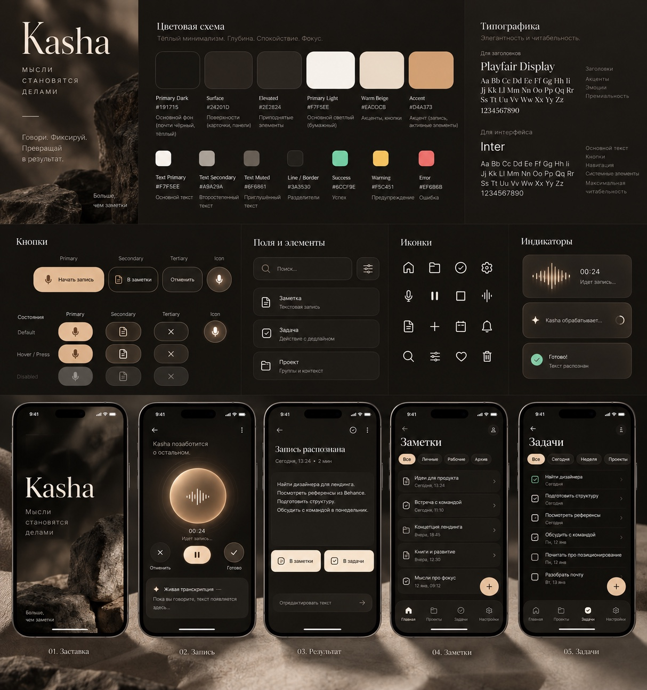
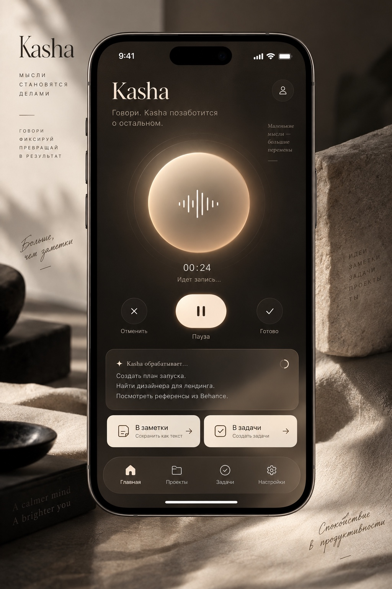

# Визуальные референсы

Изображения переданы владельцем Kasha 13 сентября 2026 и сохранены без изменений. Это визуальные ориентиры, а не экспорт актуальных экранов приложения.

| Файл | Исходное имя | Назначение |
|---|---|---|
| [01-design-board.jpeg](01-design-board.jpeg) | `B434F939-AAC4-4757-A720-BE8DC0F20528.jpeg` | Общий художественный характер: палитра, поверхности, кнопки, набор экранов |
| [02-home-reference.jpeg](02-home-reference.jpeg) | `7A3BF8EB-8D0C-45CD-A935-3C273B095386.jpeg` | Композиция Главной, материальный orb, тёплый свет, нижняя навигация |

Из рисунков не копируются текстовый логотип, serif/Inter, сторонние пиктограммы, профиль, центральные FAB и обещание live STT. Разрешение этих отличий описано в [реестре решений](../00-decisions.md). Экраны оцениваются по целевому ТЗ с реальным пользовательским содержимым, а не по буквальному совпадению с рекламным коллажем.
